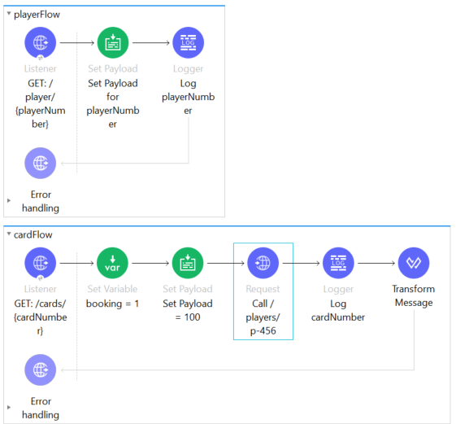

# Question 1

Which of the following is not the purpose of API Portals?

1. They include documentation and examples

2. They have the mechanism to test the API by making calls to it

3. They provide options to give feedback

4. **They provide you a platform to deploy and run the API**

# Question 2

When you make changes to implementation code of an API (not the interface part) then which of the following needs to be changed?

1. **No changes are required to API Consumers and API Portal**

2. API Portal to reflect the implementation changes

3. All the consumers of the API

4. Asset in Exchange

# Question 3

Refer to the exibit below. Flow cardFlow's HTTP Listener accepts a GET request with URI /cards/{cardNumber}. Flow cardFlow makes a HTTP call to playerFlow using HTTP Request connector and passes a URI Parameter playerNumber = p-456.

A web client makes an HTTP GET request to the cardFlow's HTTP Listener by invoking /cards/c-123. Log cardNumber logs the URI parameter cardNumber passed to cardFlow's HTTP Listener. What will be logged by Log cardNumber?

1. p-456

2. c-123

3. **null**

4. c-456

# Question 4

In a flow named myFlow, a set variable transformer sets a variable *count*. How can this variable be logged using an expression mode of Logger component?

1. #[count]

2. #[attributes.count]

3. #[variables.count]

4. **#[vars.count]**

# Question 5

What are Experiene APIs according to layering defined in API-led connectivity?

1. In Eperience APIs we perform Aggregation of data and Transformation

2. **Experience APIs package and modify the data to be best consumed by the end user**

3. Experience APIs are used to orchestrate call to different APIs involved in the business process

4. Through Experience APIs we access the system of records (data)

# Question 6

A sub-flow named childFlow needs to be called with the following payload:

`{"firstName": "Mule", "lastName": "Soft"}`

How can childFlow be called using Dataweave?

1. lookup('childFlow', payload:'{"firstName": "Mule", "lastName": "Soft"}')

2. callFlow('childFlow', '{"firstName": "Mule", "lastName": "Soft"}')

3. callFlow('childFlow', payload:'{"firstName": "Mule", "lastName": "Soft"}')

4. **lookup('childFlow', '{"firstName": "Mule", "lastName": "Soft"}')**

# Question 7

# Question 8

# Question 9

# Question 10

# Question 11

# Question 12

# Question 13 

# Question 14

# Question 15

# Question 16

# Question 17

# Question 18

# Question 19

# Question 20

# Question 21

# Question 22

# Question 23

# Question 24

# Question 25

# Question 26

# Question 27

# Question 28

# Question 29

# Question 30

